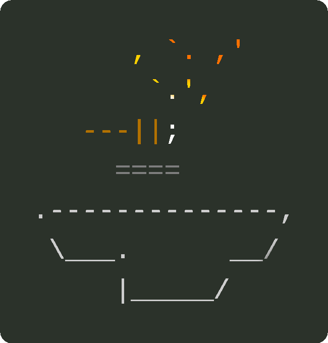
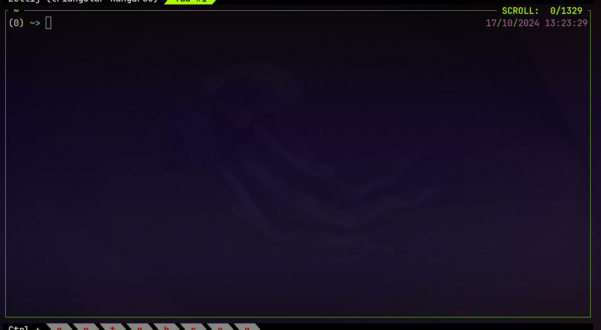

[](https://garnix.io/repo/YPares/envil)

# envil



`envil` is a tool to:

- describe a set of environments ("toolkits") that contain executables you regularly want to access and hide rapidly (see for instance [here](./examples/statedir/envil-state.yaml)),
- install and switch on/off such environments globally in an environment stack, or conversely:
- start a subshell with a specific set of environments locally activated.

`envil` does so by using [Nix](https://nixos.org), and by inspecting or creating _Nix flakes_ on the fly.
In the Nix ecosystem, a _flake_ is a file that describes a set of programs (the flake _outputs_) for various possible systems,
and how to download and build those programs and their dependencies (the flake _inputs_). Nix can then install those programs in an isolated store,
ie. without making them appear in your global `PATH`. Nix being a simple yet generic and powerful programming language,
some seemingly simple use cases (such as listing a fixed set of pre-existing packages in a flake and installing them) may _appear_ more complex
to tackle than they need to.

`envil` targets some of those simple Nix use cases. It aims at providing people who are not regular Nix users a quick way to start with custom,
isolated & reproducible (ie. "rebuildable identically elsewhere") environments, one of the major reasons to use Nix.

It is important to note that `envil` is **not** a tool to:

- install and manage Nix for you,
- write complicated Nix logic for you.

If you already know and use Nix, `envil` aims at being an alternative to the `nix profile` command which makes it inconvenient to work with
multiple profiles and contributes to cluttering your PATH. Conversely, `envil` enables you and incites you to be selective and to
quickly switch between environments or start shells to avoid situations where you end up with two different versions
of the same tool in your `PATH`, or things like two different `python` installations but each one configured with its own libraries,
leaving you unable to select which one you want.

`envil` has been developped with cooperation between Nix-users and non Nix-users in mind, notably in development teams where some people would
want to introduce Nix to provision their local development environment(s) without too much friction.
This is why `envil` introduces a simple and versionable yaml environment description, but also directly supports any flake as a package source,
and also why it operates by outputting regular Nix flakes that are locked and versionable too.



## Setup

To install `envil`, first you need to [install Nix](https://determinate.systems/nix/). Then just do:

```sh
nix profile install github:YPares/envil#envil
```

to have `envil` available in your `PATH`. Alternatively, you can run `nix run github:YPares/envil` everytime you want to use `envil`.

Finally, add `$HOME/.envil/current/bin` to your `PATH`. This is the directory in which envil will install and swap the binaries of your
current environment.

Note: if you are using Linux, it's better to set your `PATH` in your `$HOME/.pam_environment` or `$HOME/.profile` so other programs than your terminal can see the updated `PATH`.
Don't forget to log out and back in after.

## Usage

`envil` manages environments as a _stack_. That means several envs can be activated at the same time. The main commands
are `envil push` and `envil pop` to add or remove envs from the stack, and `envil show` to view the stack's current state.

The second important concept is the notion of _statedir_. That is some directory that contains a config file representing the desired state of your environments.
This file can be one of the following two:

- either an `envil-state.yaml` ("yaml statedir"): `envil` will generate a flake for each environment inside the statedir (in the `flakes` subfolder).
- or a `flake.nix` ("flake statedir"): `envil` will look at the attributes exported under `packages.<current_system>` and consider each one to be an environment.

Therefore any regular Nix flake is directly usable as a statedir (including remote flakes, e.g. from Github), and in such case `envil` will not try to write anything in it.
Note that if a statedir contains both files, `envil` will use the `flake.nix` and ignore the `envil-state.yaml`.

Most `envil` subcommands take a `-d` argument to select which statedir to read env descriptions from (regardless of whether it is a yaml or flake statedir),
and register it as the _current_ statedir so you don't have to repeat it everytime.
If the folder given to `-d` does not exist or is empty, `envil` will create it with a default `envil-state.yaml` that you can then edit.

Each environment present in your stack can come from a different statedir, thus allowing decomposition. You can for instance
have your own personal statedir for tools only you use, install tools from public flakes on Github, and then have another statedir that is part of a git project
and used by all the developers of that project. Nix `flake.lock` files ensure that all teammembers will use the exact same version
of the same tools, and Nixpkgs `buildEnv` function will make sure you do not have conflicts (different executables with the same name) in your stack.

Run `envil -h` to see all the commands available. For instance, if you clone that repository and `cd` into your local clone,
you can run the following:

- `envil shell -d examples/statedir`: show all the envs defined in the example statedir (`-d`) and select some of them.
  Then open those envs in a subshell. Register `examples/statedir` as the current statedir
- `envil switch -d examples/statedir`: select several environments in the statedir, and then replace the whole stack with them.
  Register `examples/statedir` as the current statedir.
- `envil push`: select an env from the current statedir (no `-d` was given) to add to the top of the env stack.
  Globally add to your `PATH` the executables it contains
- `envil pop`: deactivate the last env added to the stack
- `envil show` (or just `envil`): show the current statedir, the currently activated envs, the bins in the PATH, and the envs
  activated in the current subshell (if any). The source (statedir of origin) of each environment is also indicated, with a flake URL if the
  statedir is a Nix flake, and a regular absolute path if it is a yaml statedir
- `envil update`: update the flake.lock files for some environments in the current statedir. This is only for yaml statedirs.
  This is the command to use if you want to generate the flakes for a yaml statedir ahead of time, without activating any env
- `envil switch -r`: reload the current stack (for instance if you used `envil update` previously)

Subshells started by `envil` export the `$SHELL_ENV` environment variable. You can use it in your shell prompt (eg. `PS1` for `bash`) so it shows
which env(s) is (are) activated in the subshell. For instance if you use `bash`, add the following to your `.bashrc`:

```bash
if [[ -n "$SHELL_ENV" || "$SHLVL" > 1 ]]; then
    shell_env_bit='\e[0;33m[$SHELL_ENV($SHLVL)]\e[0m'
fi

PS1="${shell_env_bit}...the rest of your prompt..."
```

(`$SHLVL` is a standard `bash` environment variable telling you how many levels of subshells you are currently in)

## Updating `envil`

Run `nix profile upgrade envil --refresh` to update `envil` to the latest version.

## Pushing your current stack to a binary cache

If you have `cachix` installed and if you did set up a cache on <https://www.cachix.org>, run:

```sh
cachix push <cache_name> $HOME/.envil/current
```

Anybody who runs `cachix use <cache_name>` and switches to the same env(s) than you will benefit from the binary cache.

## Notes about versioning and workflow

In each statedir containing an `envil-state.yaml`, `envil` will generate a `flakes` folder, itself containing a `flake.nix` and `flake.lock` for each env.
These are meant to be added to your version control system, so that any person using these envs too will have the exact
same tool versions you do.

Conversely, the contents of your `$HOME/.envil` are _not_ meant to be versioned. They represent the state of your _own_ stack,
which is meant to be transient. If you often end up activating the exact same set of envs, you can declare a new env
in your statedir that will _extend_ from them, ie. merging them all together, to make things more convenient.
Statedirs can also _include_ one another to create envs that extend from envs from different statedirs.

You have two possible workflows with `envil`:

- Decomposition: smaller and separated envs, with frequent use of `envil push` and `pop`
- Composition: bigger environments that _extend_ one another, with frequent use of `envil switch`

## Related tools & philosophy

`envil` is related to [`niv`](https://github.com/nmattia/niv), [`devenv`](https://devenv.sh/), [`devbox`](https://www.jetify.com/docs/devbox/),
[`flox`](https://flox.dev/), [`flakey-profile`](https://github.com/lf-/flakey-profile) and
[`home-manager`](https://github.com/nix-community/home-manager) but with a focus on:

- usability by people who do not write or write little Nix code;
- compatibility with existing Nix tools, and no disruption of your existing Nix installation and configuration;
- reusable and composable environments, meaning that:
  - any env can extend (or import, include, whatever you prefer) other envs,
  - statedirs can be imported and included into one another,
  - you can have several environments activated at the same time;
- production of regular and (as much as possible) idiomatic Nix flakes that do not require `--impure`.

Also, `envil` strongly encourages decomposition. If you write Nix code, then writing small & local Nix flakes to
then reuse them in `envil` envs is perfectly encouraged. `envil` will not write complicated Nix logic for you,
just the classic boilerplate needed to define a top-level flake with some `pkgs.buildEnv` calls.

Contrary to `nix profile`, `envil` will not do anything to track versions of environments via a history.
Given it represents its configuration as a simple yaml file or as flakes, versioning can just be done with `git`.

